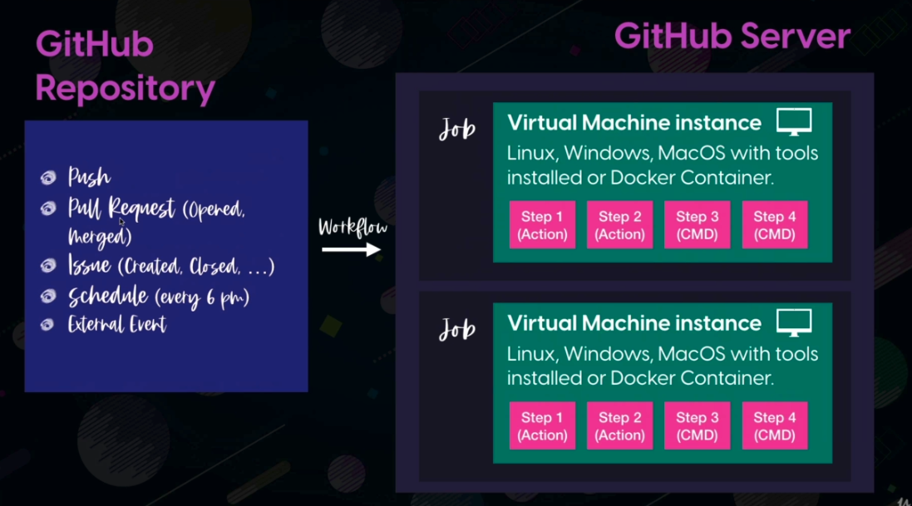

# github-actions-test

## Examples of using github actions

### Technologies used

* Vs Code
* Github account
* Repository created in github (public repository to free github actions)

### Extensions to VsCode

* [Prettier - Code formatter](https://marketplace.visualstudio.com/items?itemName=esbenp.prettier-vscode)
* [YAML to Json](https://marketplace.visualstudio.com/items?itemName=ahebrank.yaml2json)
* [YAML](https://marketplace.visualstudio.com/items?itemName=redhat.vscode-yaml)

## GitHub Actions Geral Schema

** Image: Ali Alaa - Udemy GitHub Actions Course. Link in References

## Actions

* Shell Commands (simple.yml)

### Enabling debug logging

[Create settings/secrets](https://docs.github.com/en/actions/monitoring-and-troubleshooting-workflows/enabling-debug-logging): 
* ACTIONS_RUNNER_DEBUG : true
* ACTIONS_STEP_DEBUG : true

## References

* [GitHub Actions Official Documentation](https://docs.github.com/en/actions)
* [Udemy - Ali Alaa - The Complete GitHub Actions & Workflows Guide](https://www.udemy.com/share/102DqF3@FZqdMoG9r2Aysn-CRm36i1GxiD35gdq2QvDSa9Qn5ev6IN9euejnJ55i8G0b2BWq/)
* [Shells support in Github Actions](https://docs.github.com/en/actions/learn-github-actions/workflow-syntax-for-github-actions#jobsjob_idstepsshell)